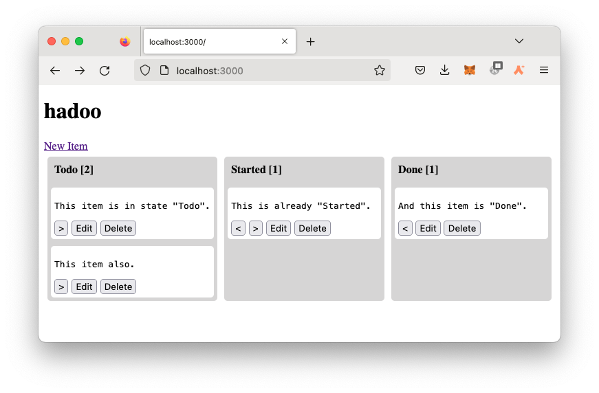
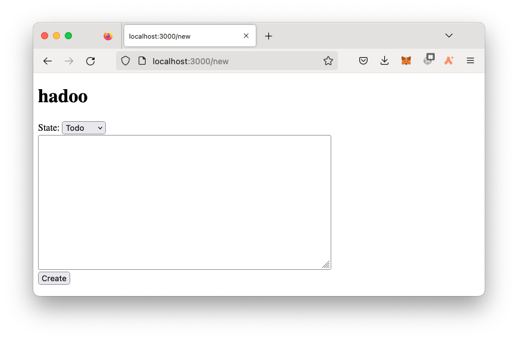
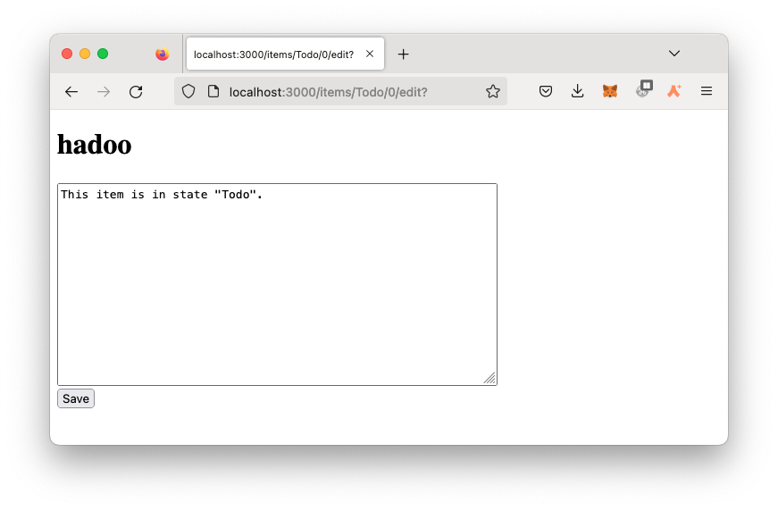

# fprog Programmierprojekt HS22

## Thema
In diesem Programmierprojekt implementieren Sie Ihren eigene Task Manager namens "Hadoo".


<p>Abbildung 1: Lanes</p>


<p>Abbildung 2: Item erzeugen</p>


<p>Abbildung 3: Item editieren</p>


## Rahmenbedingung
- Dieses Projekt ist eine **Einzelarbeit**. Gemäss Prüfungsordnung resultiert ein Verstoss gegen diese Bedingung mit der **Note 1**.
- Das Projekt muss mit GHC 8.10.7 und Cabal 3.6.2.0 (3.4.0.0 ist auch ok) gebaut und gestartet werden können.
- Es dürfen keine zusätzlichen Libraries im `hadoo.cabal` unter `build-depends` hinzugefügt werden.
- Fragen schicken Sie per Mail an `daniel.kroeni@fhnw.ch`. Ich werde dann die Frage und die Antwort auf MS Teams publizieren, damit alle dieselben Informationen haben.


## Spezifikation der Anwendung
Dieses [Video](https://tube.switch.ch/videos/DS0oEG4qdv) spezifiziert die Funktionalität der Applikation. Es ist somit Teil der Spezifikation. Schauen Sie es sich unbedingt an!

### HTTP Routen
- **Lanes Seite:** GET http://localhost:3000/
- **New Item Ansicht:** GET http://localhost:3000/new
- **New Item Erzeugen:** POST http://localhost:3000/items \
Im Request Body werden folgende Parameter (`param`) erwartet:
  - `content`: Der Text des Items.
  - `state`: Der initiale Zustand des Items.
- **Edit Item Text Ansicht:** GET http://localhost:3000/items/:state/:nr/edit 
- **Edit Item Text Speichern:** POST http://localhost:3000/items/:state/:nr/  \
Im Request Body werden folgende Parameter (`param`)  erwartet:
  - `content`: Der neue Text des Items.
- **Item State Ändern:** POST http://localhost:3000/items/:state/:nr/move/:nextState
- **Item löschen:** POST http://localhost:3000/items/:state/:nr/delete

Wie Sie den Routen entnehmen können, wird ein Item über seinen State **und** seine Nummer identifiziert.

Alle `POST` Routen machen nach erfolgter Aktion ein `redirect "/"` auf die Lanes Seite.

### Datenhaltung
Die Items werden nach State aufgeteilt unter [./data/](./data) abgelegt. Die Demo Daten werden wie folgt abgegeben:
```
data
├── Done
│   └── 000.txt
├── Started
│   └── 000.txt
└── Todo
    ├── 000.txt
    └── 001.txt
```
Ein Item wird als Text Datei unter `data/<state>/<padded_nr>.txt` abgespeichert.
- `<state>` ist dabei der Name des Zustands des Items. In den Initialdaten sind die drei Zustände `Todo`, `Started` und `Done` als Ordner angelegt.
- `<padded_nr>` ist eine, auf drei Stellen mit `0` aufgefüllte Zahl.
Durch dieses Namensschema lassen sich die Dateinamen sortieren und die Items in der entsprechenden Reihenfolge anzeigen. Ein neu erstelltes Item, oder ein Item, das in einen anderen Zustand verschoben wird, soll immer eine neue Nummer bekommen, dass es nach dieser Nummer sortiert als letztes kommt.

⚠️ Ich empfehle die Items mit einem `State` und einem `Int` zu identifizieren (z.B. `Todo` und `1`) und den `Int` nur für den Dateizugriff in das dreistellige Muster (z.B. `001`) zu übersetzen.

Sie werden eine Funktion benötigen, die für einen State, den nächsten `Int` findet. Dazu müssen Sie die Namen aller Dateien in einem Ordner laden, deren Nummer von `.txt` trennen und mit `read` in einen `Int` parsen. Von den `Int`s wollen Sie dann das Maximum + 1 zurückgeben.
Für den `State` namens `Todo` würde diese Funktion jetzt den Wert `2` zurückgeben.

Es ist nicht verlangt, dass die Items von `000` an lückenlos abgelegt sind. Durch Löschen und Verschieben ist es durchaus möglich, dass es Lücken in der Nummerierung gibt. 
```
    Todo
    ├── 001.txt
    └── 005.txt
```
Wenn nun ein neues Item im Zustand `Todo` erstellt wird, soll es unten angefügt werden:
```
    Todo
    ├── 001.txt
    ├── 005.txt
    └── 006.txt
```

## Aufgabe
Implementieren Sie die beschriebene Applikation. Ich schlage vor, dass Sie etwa in der Reihenfolge der funktionalen Kriterien vorgehen.

## **Bewertung**
Für jede Anforderung kann 1 Punkt erreicht werden. In diesem Projekt sind total 12 Punkte erreichbar. 
⚠️ Wichtig! Die Kriterien sind **Alles oder Nichts**. Halb erfüllte Kriterien geben 0 Punkte.


### **Funktionale Anforderungen (8 Punkte)**

#### **(F1) Lanes Ansicht**
Auf der Startseite [http://localhost:3000/](http://localhost:3000/) wird mindestens folgendes Angezeigt:
- Ein Titel z.B. "Hadoo"
- Drei Lanes "Todo", "Started" und "Done" in eben genannter Reihefolge mit Titel.
- Jeder Lane Titel enthält zusätzlich die Anzahl enthaltener Items.
- Die vier Items der Initialdaten, jeweils in der richtigen Lane. Zwingend ist nur der Text der Items.

#### **(F2) Item Löschen**
Jedes Item hat einen Button mit dem Text "Delete". Beim Drücken sind folgende Effekte beobachtbar:
- Die zugehörige Datei wird aus dem Dateisystem gelöscht.
- Nach dem Löschen leitet ein Redirect auf die Lanes Ansicht um.
- Das gelöschte Item ist nicht mehr sichtbar.

#### **(F3) New Item**
Auf der Lanes Ansicht gibt es einen Button oder Link mit dem Text "New Item". Beim Drücken erscheint eine neue HTML Seite, die ein leeres Textfeld, ein Dropdown Menu, das die verfügbaren Zustände anbietet und ein "Save" Button darstellt.

#### **(F4) New Item Effekte**
Wenn auf der "New Item" Seite der "Save" Button gedrückt wird, sind folgende Effekte beobachtbar:
- Es wird eine neue Datei erzeut unter `data/<state>/<nr>.txt` 
  - `<state>` ist dabei der Name des im Dropdown Menu gewählten Zustands.
  - `<nr>` ist die nächste freie Nummer (padded mit 0 auf drei Stellen) in diesem Ordner.
- Der Inhalt der Datei ist der Text, der im Textfeld eingegeben wurde.
- Nach dem Speichern leitet ein Redirect auf die Lanes Ansicht um.
- Das neue Item wird zuunterst im ausgewählten Zustand dargestellt.

#### **(F5) Edit Item**
Jedes Item hat einen Button oder Link mit der Text "Edit". Beim Drücken erscheint eine neue HTML Seite, die in einem Textfeld den aktuellen Text des entsprechenden Items darstellt. Zudem wird ein "Save" Button darstellt.

#### **(F6) Edit Item Effekte**
Wenn auf der "Edit Item" Seite der "Save" Button gedrückt wird, sind folgende Effekte beobachtbar:
- Der Text Inhalt der entsprechenden Datei wurde überschrieben mit dem Text, der im Textfeld eingegeben wurde.
- Nach dem Speichern leitet ein Redirect auf die Lanes Ansicht um. 
- Auf der Lanes Ansicht wird der aktualisierte Text dargestellt. Das Items ändern die Reihenfolge nicht.

#### **(F7) Move Item**
Jedes Item hat Buttons um den Zustand zu verändern. Items im ersten oder letzten Zustand können jeweils nur in eine Richtung verschoben werden und haben dazu nur einen Button. Alle anderen Items haben zwei Buttons um in beide Richtungen den Zustand zu ändern.

#### **(F8) Move Item Effekte**
Wenn ein verschiebe Button gedrückt wird, ist folgende Effekte beobachtbar:
- Die ursprüngliche Datei des Items unter `data/<old_state>/<old_nr>.txt` verschwindet
- Eine neue Datei erscheint unter `data/<new_state>/<new_nr>.txt`
  - `<new_nr>` ist dabei die nächste freie Nummer, (padded mit 0 auf drei Stellen) im Ordner namens `<new_state>`
- Der Inhalt der Datei ist derselbe Text des ursprünglichen Items.
- Auf der Lanes Ansicht wird das Item im neuen Zustand als unterstes Item dargestellt.


### **Nicht Funktionale Anforderung (4 Punkte)**
#### **(NF1) Codesize:**
Der Code muss auf mindestens 3 Module aufgeteilt sein. `app/Main.hs` und `test/HadooTest.hs` werden dabei nicht mitgezählt. 
Zudem darf keine Funktion länger als 20 Zeilen lang sein (Kommentare und Leerzeilen werden nicht mitgezählt).
⚠️ Wenn auch nur eine Funktion länger als 20 Zeilen ist (Signatur mitgezählt), gibt es 0 Punkte.

#### **(NF2) Typsignaturen:**
Jede top-level Deklaration (Konstanten und Funktionen) muss eine Typsignatur haben.
⚠️ Wenn auch nur eine Signatur fehlt, gibt es 0 Punkte.

#### **(NF3) Storage Module:**
Die Persistenz wird in einem einizgen Modul implementiert.
Kriterium: Nur ein einziges Modul importiert Funktionalität von `System.Directory`.

#### **(NF4) Flexible Zustände:**
Die möglichen Zustände eines Items, werden über einen Datentyp definiert. 
```haskell
data State = Todo | Started | Done deriving (Show, Read, Eq, Ord, Enum, Bounded)
```
Das UI soll sich nach den Wert-Konstruktoren dieses Datentypes anpassen. 
Die Reihenfolge der Definition beschreibt die Reihenfolge der Lanes im UI. 
Auch die Ordner Struktur im Filesystem soll automatisch nach den Namen dieser Wertkonstruktoren angelegt werden.
Kriterium: 
Beim Hinzufügen eines einzlenen Wertkonstruktors, z.B. `| Archive` soll die Applikation ohne eine weitere Änderung kompiliert und gestartet werden können und mit dieser zusätzlichen Lane funktionieren. Auch die Ordner Struktur im Dateisystem soll automatisch erweitert werden. (Ordern müssen aber nicht gelöscht werden, wenn Wertkonstruktoren entfernt werden.)
Beachten Sie die Hinweise zu den Typklassen [Enum und Bounded](#enum-und-bounded). 


## Hinweise
### **Wichtig! Newline Probleme vermeiden**
Um Probleme mit Newline Control-Characters zu vermeiden, müssen Sie beim Einlesen des Item Texts, die `\r` Zeichen entfernen. Verwenden Sie also **nicht** `param "content"` sondern die vorgegebene Funktion `multiLineTextParam "content"`. Dies gilt nur für die `"content"` Texte eines Items. Alle anderen Parameter lesen Sie normal mit `param`.
----
### **Arbeiten mit Scotty**
Mit `redirect :: Text -> ActionM a` kann auf eine andere Seite umgeleitet werden. 
https://hackage.haskell.org/package/scotty-0.12/docs/Web-Scotty.html#v:redirect
Beispiel: Umleitung auf Home Page:
```haskell
redirect "/"
```
----
### **Sortieren von Listen**
Im Modul `Data.List` sind viele praktische Funktionen zu finden um mit Listen zu arbeiten:
```haskell
import Data.List (sort)
```
`sort :: Ord a => [a] -> [a]` sortiert eine Liste.

----
### **Arbeiten mit Pfaden**
Das Typalias `FilePath` ist ein Alias für den Typ `String`. Pfade auf Dateien und Ordner können Sie also leicht aus `String`s zusammenbauen. Als Pfadseparator verwenden Sie bitte alle `"/"`, auch auf Windows. Alle Pfade sollten relative zum Wurzelverzeichnis des Projekts sein. Wenn Sie absolute Pfade verwenden, wird das bei anderen Studierenden dann nicht funktionieren.

----
### **Enum und Bounded**
Die Typklasse `Bounded` erlaubt den kleinsten Wertkonstruktor (`minBound`) und den grössten Wertkonstruktor (`maxBound`) eines Typs abzufragen. 
```haskell
data State = Todo | Started | Done deriving (Show, Eq, Bounded, Enum)
```
Für obige Definition gibt `minBound :: State` also den Wert `Todo` zurück und für `maxBound :: State` den Wert `Done`.
Die Klasse `Enum` erlaubt mit der Funktion `enumFromTo` eine Liste aller Werte zwischen zwei Grenzen zurückzugeben. Zudem kann mit der Funktion `succ` der Nachfolger (successor) eines Wertes und mit `pred` der Vorgänger eines Wertes abgefragt werden.
Achtung: `succ` wirft ein Laufzeitfehler, wenn das Argument bereits maxBound ist. Analaog wirft `pred` ein Laufzeitfehler, wenn das Argument minBound ist. 

Weitere Infos finden Sie in der [Dokumentation](https://hackage.haskell.org/package/base-4.17.0.0/docs/GHC-Enum.html).

----
### **Arbeiten mit `IO a` und `ActionM a`**
Folgende Funktion könnten sich als nützlich erweisen:
```haskell
import Control.Monad (mapM)

mapM :: (a -> m b) -> [a] -> m [b]
mapM_ :: (a -> m b) -> [a] -> m () -- wie mapM, ignoriert das Resultat, aber hat die Effekte
sequence :: [m a] -> m [a]
sequence_ :: [m a] -> m () -- wie sequence, ignoriert das Resultat, aber hat die Effekte
```

Das `m` kann dabei für `IO` oder auch `ActionM` stehen. So können Sie z.B. zwei Strings von der Konsole einlesen:

```haskell
readTwoStrings :: IO [String]
readTwoStrings = mapM (\s -> putStrLn s >> getLine) ["a:","b:"]
```

----
#### **Arbeiten mit dem Dateisystem**
Wir verwenden Funktionen aus dem Package [directory](https://hackage.haskell.org/package/directory-1.3.6.1/docs/System-Directory.html) um Verzeichnisse zu erzeugen und deren Inhalte aufzulisten.
Die Funktionen sind im Modul `System.Directory` und müssen entsprechend importiert werden.

```
import System.Directory (listDirectory, doesDirectoryExist, createDirectory, doesFileExist, renameFile, removeFile)
```
⚠️ Verwenden Sie `listDirectory` und nicht `getDirectoryContents`, da es sonst Probleme mit `.` und `..` im Resultat kommen kann.

----
#### **Arbeiten mit Modulen**
Zusätzliche Module müssen im `hadoo.cabal` File unter `library` `->` `exposed-modules:` hinzugefügt werden. Sonst scheitert `gcc` in der Linker Phase:

```
ld: symbol(s) not found for architecture x86_64
clang: error: linker command failed with exit code 1 (use -v to see invocation)
`gcc' failed in phase `Linker'. (Exit code: 1)
```
Achten Sie auf korrekte Gross-Kleinschreibung der Modulnamen. Windows ist da weniger strikt als OSX - aber Ihr Projekt muss auf allen Plattformen funktionieren.

----
#### **Html für Anfänger**
> Halten Sie das Html einfach, das ist keine Web-Vorlesung.

Eine statische [HTML Demo-Seite](./static/lanes_example.html) zur orientierung und ein vorbereitetes [CSS](./static/styles.css) zur direkten Verwendung steht zur Verfügung.

Folgende Seite konsultiere ich regelmässig, wenn ich Html schreiben muss: https://www.w3schools.com/

- [Basics](https://www.w3schools.com/html/html_basic.asp)
- [Links](https://www.w3schools.com/html/html_links.asp)
- [Formular](https://www.w3schools.com/html/html_forms.asp)
- [Textarea](https://www.w3schools.com/tags/tag_textarea.asp)

**Dropdown in Form**
Folgendes Form sendet beim Drücken des Create Buttons einen POST Request mit den `param` Namens `state` für den ausgewählten Zustand im Dropdown und `content` für den Text in der Textarea:
```html
<form method='post' action='/items'>
  <label for='states'>State: </label>
  <select name='state' id='states'>
    <option value='Todo'>Todo</option>
    <option value='Started'>Started</option>
  </select>
  <br>
  <textarea name='content' rows='12' cols='60'></textarea>
  <br>
  <input type='submit' value='Create'></input>
</form>
```

**`<` und `>`:**
Die spitzen Klammern werden in HTML mit &lt; und &gt; codiert.

**POST Actions:**
Ein Button mit einer POST Action können Sie mit folgendem HTML erzeugen:
```html
<form method='post' action='/items/Done/1/delete' class='inline'>
  <button type='submit'>Delete</button>
</form>
```

**Preformatted Text:**
Unsere Items enthalten Zeilenumbrüche. Damit diese bei der Ansicht übernommen werden, können Sie den Inhalt der Seite in ein [\<pre>](https://www.w3schools.com/tags/tag_pre.asp) Tag verpacken.

**CSS:**
Sie brauchen keine eigenen Styles hinzuzufügen. Wenn Sie das aber trotzdem machen, müssen Sie evtl. im Browser mit einem Hard-Reload `CTRL-Shift-R` / `CMD-Shift-R` die Seite neu laden.
